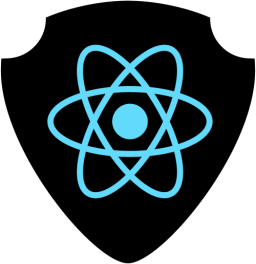
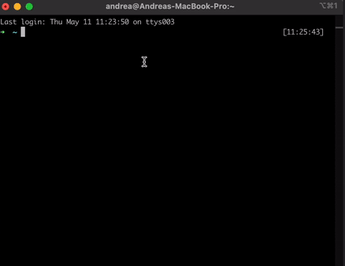

<h1 align="center">
  <br>
  <a href="https://github.com/onebeyond/shieldjs"></a>
  <br>
  <strong>SHIELD.JS</strong>
  <br>
</h1>

<h4 align="center"><strong>The new frontend project by One Beyond. From developers, to developers.</strong></h4>

[Why Shield.js](#❓-why-shieldjs) -
[Key Features](#🔑-key-features) -
[Getting Started](#🏁-getting-started) -
[System Requirements](#🛠-system-requirements) -
[Installation](#🏗-installation) -
[Meet the team](#🫂-meet-the-team) -
[Contributing](#❤️-contributing) -
[License](#✅-license)
<br>

## ❓ **Why Shield.js**

> ### Shield.js

Shield.js is a new project powered by One Beyond that provides a comprehensive set of frontend tools that every developer uses on a daily basis. Leaving aside the tedious procedure of installing the same tools over and over again, with Shield.js the developer will find a lot of the necessary packages once the installation process is finished.

<br>

> ### The philosophy behind Shield.js

Always from the developer's perspective and understanding the time involved in the process of starting a project, we have the necessity to propose a general solution that covers and speeds up the first steps at the beginning of the project and, in this way unify as much as possible the tools and technologies that will take prominence throughout the life of the project.
That is why, for frontline developers, we have created Shield.js

<br>

## 🔑 **Key Features**

> ### Some of the key features of Shield.js include:

- Easy to install, easy to use
- Project scaffolding using day to day technologies
  - <a href="https://es.react.dev/"> React</a>
  - <a href="https://www.typescriptlang.org/"> TypeScript</a>
  - <a href="https://vitejs.dev/"> Vite</a>
  - <a href="https://playwright.dev/"> Playwright</a>
  - <a href="https://storybook.js.org/"> Storybook</a>
  - <a href="https://www.hygen.io/"> Hygen</a>
  - <a href="https://stitches.dev/"> Stitches</a>

<br>

## 🏁 **Getting Started**

> ### Because a picture is worth a thousand words... 📹



<br>

## 🛠 **System requirements**

> ### It is necessary to have these packages updates to:

- `node: v18.12.1`
- `npm: v8.19.2`

<br>

## 🏗 **Installation**

> ### For the time being, Shield.js can be installed from source

```bash
# Clone this repository
$ git clone https://github.com/onebeyond/shieldjs.git

# Go into the repository
$ cd shieldjs

# Install dependencies
$ npm install

# Run the app
$ npm run start
```

<br>

## 🫂 **Meet the team**

> ### We are the members from the Frontend Chapter in One Beyond. This is us:

<!-- ALL-CONTRIBUTORS-LIST:START - Do not remove or modify this section -->
<!-- prettier-ignore-start -->
<!-- markdownlint-disable -->
<table>
  <tbody>
    <tr>
      <td align="center" valign="top" width="16.66%"><a href="https://github.com/jgleal"><br /><sub><b>Javier G. Leal
      </b></sub></a><br /></td>
      <td align="center" valign="top" width="16.66%"><a href="https://github.com/jmtorralvo"><br /><sub><b>Jose Manuel Torralvo
      </b></sub></a><br /></td>
      <td align="center" valign="top" width="16.66%"><a href="https://github.com/Donivanes"><br /><sub><b>Iván Esteban
      </b></sub></a><br /></td>
      <td align="center" valign="top" width="16.66%"><a href="https://github.com/robertoHeCi"><br /><sub><b>Roberto Hernández
      </b></sub></a><br /></td>
      <td align="center" valign="top" width="16.66%"><a href="https://github.com/Franky-OB"><br /><sub><b>Francisco Molina
      </b></sub></a><br /></td>
      <td align="center" valign="top" width="16.66%"><a href="https://github.com/acalvom"><br /><sub><b>Andrea Calvo
      </b></sub></a><br /></td>
    </tr>
  </tbody>
</table>
<!-- markdownlint-restore -->
<!-- prettier-ignore-end -->

<!-- ALL-CONTRIBUTORS-LIST:END -->
<br>

## 📖 Documentation

> ### For more information on how to use ShieldJS, please refer to the [official documentation](https://onebeyond.github.io/shieldjs/).

<br>

## ❤️ Contributing

> ### Do you feel you can contribute or give feedback to the project?

If you would like to contribute to ShieldJS, please feel free to submit a pull request or open an issue on the [GitHub repository](https://github.com/onebeyond/shieldjs). We welcome contributions of all kinds, including bug fixes, feature enhancements, and documentation improvements.

If you only want to highlight our project because it helped you in some way, you can give us a ⭐️ !

<br>

## ✅ License

ShieldJS is licensed under the [MIT License](https://github.com/onebeyond/shieldjs/blob/main/LICENSE).
